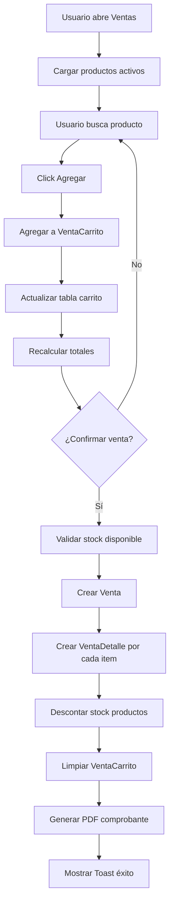

# 🛒 PLAN COMPLETO: Módulo Ventas + Reportes JasperReports

**Fecha:** 2025-11-24
**Prioridad:** URGENTE
**Objetivo:** Sistema completo de ventas con generación de comprobantes PDF

---

## 📊 ESTADO ACTUAL

### ✅ Backend COMPLETO (100%)
```
MODELOS:
├── Venta (cabecera: cliente, usuario, total, IGV, comprobante, fecha)
├── VentaDetalle (líneas: producto, cantidad, precio, descuento, subtotal)
├── VentaCarrito (temporal: productos antes de confirmar)
└── Cliente (DNI/RUC, nombre, email, tipo)

ENUMS:
├── TipoComprobante (FACTURA, BOLETA, NOTA_CREDITO, NOTA_DEBITO)
├── TipoCliente (NATURAL, JURIDICO)
└── TipoDocumento (DNI, RUC, PASAPORTE, etc.)

REPOSITORIES + SERVICES:
✅ VentaRepository + VentaServiceImpl
✅ VentaDetalleRepository + VentaDetalleServiceImpl
✅ VentaCarritoRepository + VentaCarritoServiceImpl
✅ ClienteRepository + ClienteServiceImpl
✅ ProductoRepository + ProductoServiceImpl
```

### ❌ Frontend PENDIENTE (0%)
```
- VentasController.java
- ventas.fxml
- ClientesController.java (opcional, puede ser genérico temporal)
- ReportService.java (JasperReports)
```

---

## 🎯 PLAN DE IMPLEMENTACIÓN (3 FASES)

### **FASE 1: Ventas UI (URGENTE)** ⚡ 2-3 horas

#### **Decisión:** Cliente genérico por ahora
```java
// Solución temporal: Cliente por defecto "PÚBLICO GENERAL"
Cliente clienteGenerico = clienteService.findByNumeroDocumento("99999999")
    .orElseGet(() -> crearClienteGenerico());

private Cliente crearClienteGenerico() {
    return Cliente.builder()
        .tipoCliente(TipoCliente.NATURAL)
        .tipoDocumento(TipoDocumento.DNI)
        .numeroDocumento("99999999")
        .nombreCompleto("PÚBLICO GENERAL")
        .emailCliente(null)
        .estadoCliente(true)
        .build();
}
```

**Beneficio:** Permite generar ventas inmediatamente sin CRUD de Clientes.

---

#### **Estructura de pantalla:** TODO-EN-UNO

```
┌──────────────────────────────────────────────────────────────────┐
│ TOP SECTION (Encabezado de venta)                               │
├──────────────────────────────────────────────────────────────────┤
│ ComboBox Cliente: [PÚBLICO GENERAL ▼]  (temporal: solo 1 opción)│
│ ComboBox Comprobante: [BOLETA ▼]                                │
│ TextField Serie: [B001]  TextField Número: [00000001]           │
│ Label Fecha: [24/11/2025 13:45]                                 │
├──────────────────────────────────────────────────────────────────┤
│ CENTER (2 columnas con SplitPane)                                │
│ ┌──────────────────────────┬──────────────────────────────────┐ │
│ │ LEFT (60%): PRODUCTOS    │ RIGHT (40%): CARRITO             │ │
│ │                          │                                  │ │
│ │ Search: [buscar...]      │ DETALLE DE VENTA                 │ │
│ │ ┌────────────────────┐   │ ┌──────────────────────────────┐ │ │
│ │ │ TABLA PRODUCTOS    │   │ │ TABLA CARRITO                │ │ │
│ │ │ - Código           │   │ │ - Producto                   │ │ │
│ │ │ - Nombre           │   │ │ - Cantidad (editable)        │ │ │
│ │ │ - Precio           │   │ │ - Precio                     │ │ │
│ │ │ - Stock            │   │ │ - Subtotal                   │ │ │
│ │ │                    │   │ │ [Quitar]                     │ │ │
│ │ │ [Agregar →]        │   │ │                              │ │ │
│ │ └────────────────────┘   │ └──────────────────────────────┘ │ │
│ └──────────────────────────┴──────────────────────────────────┘ │
├──────────────────────────────────────────────────────────────────┤
│ BOTTOM (Totales y botones)                                       │
│                                   Subtotal:  S/ 100.00           │
│                                   IGV (18%): S/  18.00           │
│                                   TOTAL:     S/ 118.00           │
│                                                                  │
│                         [Cancelar] [💾 Confirmar Venta]          │
└──────────────────────────────────────────────────────────────────┘
```

---

#### **Flujo de trabajo:**



---

#### **Archivos a crear:**

**1. VentasController.java** (~1200-1500 líneas)
```
src/main/java/pe/edu/upeu/farmafx/controller/VentasController.java
```

**Secciones principales:**
```java
@RequiredArgsConstructor
@Slf4j
@Component
public class VentasController {

    // ========== DEPENDENCIAS ==========
    private final IVentaService ventaService;
    private final IVentaCarritoService carritoService;
    private final IProductoService productoService;
    private final IClienteService clienteService;
    private final SessionManager sessionManager;
    private final ReportService reportService; // ← NUEVO (JasperReports)

    // ========== COMPONENTES FXML ==========
    // TOP
    @FXML private ComboBox<String> cbxCliente;
    @FXML private ComboBox<String> cbxTipoComprobante;
    @FXML private TextField txtSerie, txtNumero;
    @FXML private Label lblFecha;

    // LEFT: Tabla productos
    @FXML private TextField txtBuscarProducto;
    @FXML private TableView<Producto> tableProductos;
    @FXML private TableColumn<Producto, String> colCodigo, colNombre;
    @FXML private TableColumn<Producto, BigDecimal> colPrecio;
    @FXML private TableColumn<Producto, Integer> colStock;

    // RIGHT: Tabla carrito
    @FXML private TableView<VentaCarrito> tableCarrito;
    @FXML private TableColumn<VentaCarrito, String> colProductoCarrito;
    @FXML private TableColumn<VentaCarrito, Integer> colCantidadCarrito;
    @FXML private TableColumn<VentaCarrito, BigDecimal> colPrecioCarrito, colSubtotalCarrito;

    // BOTTOM: Totales
    @FXML private Label lblSubtotal, lblIGV, lblTotal;
    @FXML private Button btnConfirmar, btnCancelar;

    // ========== DATOS ==========
    private ObservableList<Producto> productosData = FXCollections.observableArrayList();
    private ObservableList<VentaCarrito> carritoData = FXCollections.observableArrayList();

    private static final BigDecimal IGV_RATE = new BigDecimal("0.18"); // 18%

    // ========== MÉTODOS PRINCIPALES ==========

    @FXML
    public void initialize() {
        configurarTablas();
        configurarBusqueda();
        configurarClienteGenerico();
        cargarProductos();
        cargarCarrito();
        actualizarTotales();
    }

    @FXML
    private void agregarAlCarrito() {
        Producto selected = tableProductos.getSelectionModel().getSelectedItem();
        if (selected == null) {
            Toast.showWarning(obtenerStage(), "Seleccione un producto", Toast.DURATION_NORMAL);
            return;
        }

        if (selected.getStockActual() <= 0) {
            Toast.showError(obtenerStage(), "Producto sin stock", Toast.DURATION_NORMAL);
            return;
        }

        // Buscar si ya está en carrito
        Optional<VentaCarrito> existente = carritoData.stream()
            .filter(c -> c.getProductoCarrito().getIdProducto().equals(selected.getIdProducto()))
            .findFirst();

        if (existente.isPresent()) {
            incrementarCantidad(existente.get());
        } else {
            crearNuevoItemCarrito(selected);
        }
    }

    private void crearNuevoItemCarrito(Producto producto) {
        VentaCarrito item = VentaCarrito.builder()
            .cantidadCarrito(1)
            .precioUnitarioCarrito(producto.getPrecioVenta())
            .totalCarrito(producto.getPrecioVenta())
            .productoCarrito(producto)
            .usuarioCarrito(sessionManager.getCurrentUser())
            .estadoCarrito(true)
            .build();

        carritoService.save(item);
        cargarCarrito();
        actualizarTotales();
    }

    @FXML
    private void confirmarVenta() {
        if (carritoData.isEmpty()) {
            Toast.showWarning(obtenerStage(), "Agregue productos al carrito", Toast.DURATION_NORMAL);
            return;
        }

        if (!DialogHelper.showConfirmar(obtenerStage(), "Confirmar Venta",
            "¿Confirmar venta por " + lblTotal.getText() + "?")) {
            return;
        }

        Task<Long> task = new Task<>() {
            @Override
            protected Long call() throws Exception {
                // 1. Crear Venta (cabecera)
                Venta venta = Venta.builder()
                    .tipoComprobanteVenta(TipoComprobante.valueOf(cbxTipoComprobante.getValue()))
                    .serieComprobanteVenta(txtSerie.getText())
                    .numeroComprobanteVenta(txtNumero.getText())
                    .subtotalVenta(calcularSubtotal())
                    .igvVenta(calcularIGV())
                    .totalVenta(calcularTotal())
                    .clienteVenta(obtenerClienteSeleccionado())
                    .usuarioVenta(sessionManager.getCurrentUser())
                    .fechaGeneracionVenta(LocalDateTime.now())
                    .estadoVenta(true)
                    .build();

                venta = ventaService.save(venta);

                // 2. Crear VentaDetalle por cada item del carrito
                for (VentaCarrito item : carritoData) {
                    VentaDetalle detalle = VentaDetalle.builder()
                        .cantidadVenta(item.getCantidadCarrito())
                        .precioUnitarioVenta(item.getPrecioUnitarioCarrito())
                        .descuentoVenta(BigDecimal.ZERO)
                        .subtotalDetalleVenta(item.getTotalCarrito())
                        .venta(venta)
                        .productoVenta(item.getProductoCarrito())
                        .build();

                    ventaDetalleService.save(detalle);

                    // 3. Descontar stock
                    Producto producto = item.getProductoCarrito();
                    producto.setStockActual(producto.getStockActual() - item.getCantidadCarrito());
                    productoService.save(producto);
                }

                // 4. Limpiar carrito
                carritoService.deleteAll(carritoData);

                return venta.getIdVenta();
            }
        };

        task.setOnSucceeded(e -> {
            Long idVenta = task.getValue();
            Toast.showSuccess(obtenerStage(), "Venta registrada exitosamente", Toast.DURATION_LONG);

            // Generar PDF
            reportService.generarComprobante(idVenta);

            // Resetear vista
            limpiarVenta();
            cargarProductos();
            actualizarTotales();
        });

        task.setOnFailed(e -> {
            log.error("Error al confirmar venta", task.getException());
            Toast.showError(obtenerStage(), "Error: " + task.getException().getMessage(),
                Toast.DURATION_LONG);
        });

        new Thread(task).start();
    }

    private BigDecimal calcularSubtotal() {
        return carritoData.stream()
            .map(VentaCarrito::getTotalCarrito)
            .reduce(BigDecimal.ZERO, BigDecimal::add);
    }

    private BigDecimal calcularIGV() {
        return calcularSubtotal().multiply(IGV_RATE).setScale(2, RoundingMode.HALF_UP);
    }

    private BigDecimal calcularTotal() {
        return calcularSubtotal().add(calcularIGV());
    }
}
```

---

**2. ventas.fxml**
```
src/main/resources/view/ventas/ventas.fxml
```

**Estructura:**
```xml
<?xml version="1.0" encoding="UTF-8"?>
<BorderPane prefHeight="720" prefWidth="1200"
    stylesheets="@../../css/components.css, @../../css/tables.css, ...">

    <top>
        <VBox spacing="12" styleClass="top-section">
            <!-- Cliente + Comprobante + Serie/Número -->
        </VBox>
    </top>

    <center>
        <SplitPane dividerPositions="0.6">
            <!-- LEFT: Tabla productos -->
            <VBox spacing="10">
                <TextField fx:id="txtBuscarProducto" promptText="Buscar producto..."/>
                <TableView fx:id="tableProductos" VBox.vgrow="ALWAYS">
                    <!-- Columnas -->
                </TableView>
                <Button fx:id="btnAgregar" text="Agregar →" onAction="#agregarAlCarrito"/>
            </VBox>

            <!-- RIGHT: Carrito -->
            <VBox spacing="10">
                <Label text="DETALLE DE VENTA" styleClass="form-title"/>
                <TableView fx:id="tableCarrito" VBox.vgrow="ALWAYS">
                    <!-- Columnas con botón Quitar -->
                </TableView>
            </VBox>
        </SplitPane>
    </center>

    <bottom>
        <VBox spacing="10" styleClass="bottom-section">
            <!-- Totales -->
            <HBox alignment="CENTER_RIGHT">
                <Label text="Subtotal:"/>
                <Label fx:id="lblSubtotal" text="S/ 0.00"/>
            </HBox>
            <HBox alignment="CENTER_RIGHT">
                <Label text="IGV (18%):"/>
                <Label fx:id="lblIGV" text="S/ 0.00"/>
            </HBox>
            <HBox alignment="CENTER_RIGHT">
                <Label text="TOTAL:" styleClass="total-label"/>
                <Label fx:id="lblTotal" text="S/ 0.00" styleClass="total-value"/>
            </HBox>

            <!-- Botones -->
            <HBox alignment="CENTER_RIGHT" spacing="10">
                <Button fx:id="btnCancelar" text="Cancelar"/>
                <Button fx:id="btnConfirmar" text="Confirmar Venta"/>
            </HBox>
        </VBox>
    </bottom>
</BorderPane>
```

---

### **FASE 2: Reportes JasperReports** 📄 1-2 horas

#### **Dependencia Maven:**

```xml
<!-- pom.xml -->
<dependency>
    <groupId>net.sf.jasperreports</groupId>
    <artifactId>jasperreports</artifactId>
    <version>6.21.2</version>
</dependency>

<!-- Opcional: Para soporte de gráficos -->
<dependency>
    <groupId>net.sf.jasperreports</groupId>
    <artifactId>jasperreports-fonts</artifactId>
    <version>6.21.2</version>
</dependency>
```

---

#### **Estructura de directorios:**

```
src/main/resources/
├── reports/                          ← NUEVA CARPETA
│   ├── comprobante_venta.jrxml      ← Diseño editable
│   ├── comprobante_venta.jasper     ← Compilado (generado automáticamente)
│   └── logo_farmacia.png            ← Logo para encabezado
└── generated_reports/                ← PDFs generados (gitignore)
    └── .gitkeep
```

---

#### **ReportService.java**

```java
// src/main/java/pe/edu/upeu/farmafx/service/impl/ReportServiceImpl.java

@Slf4j
@Service
@RequiredArgsConstructor
public class ReportServiceImpl implements IReportService {

    private final IVentaService ventaService;
    private final IVentaDetalleService ventaDetalleService;

    private static final String REPORTS_PATH = "/reports/";
    private static final String OUTPUT_PATH = "src/main/resources/generated_reports/";

    @Override
    public File generarComprobante(Long idVenta) {
        try {
            log.info("Generando comprobante para venta ID: {}", idVenta);

            // 1. Obtener venta
            Venta venta = ventaService.findById(idVenta)
                .orElseThrow(() -> new IllegalArgumentException("Venta no encontrada"));

            // 2. Cargar plantilla .jasper
            InputStream reportStream = getClass().getResourceAsStream(
                REPORTS_PATH + "comprobante_venta.jasper");

            if (reportStream == null) {
                throw new FileNotFoundException("Plantilla de reporte no encontrada");
            }

            // 3. Preparar parámetros
            Map<String, Object> parameters = new HashMap<>();
            parameters.put("idVenta", venta.getIdVenta());
            parameters.put("tipoComprobante", venta.getTipoComprobanteVenta().getDescripcion());
            parameters.put("serie", venta.getSerieComprobanteVenta());
            parameters.put("numero", venta.getNumeroComprobanteVenta());
            parameters.put("fecha", venta.getFechaGeneracionVenta().format(
                DateTimeFormatter.ofPattern("dd/MM/yyyy HH:mm")));
            parameters.put("cliente", venta.getClienteVenta().getNombreCompleto());
            parameters.put("clienteDoc", venta.getClienteVenta().getNumeroDocumento());
            parameters.put("subtotal", venta.getSubtotalVenta());
            parameters.put("igv", venta.getIgvVenta());
            parameters.put("total", venta.getTotalVenta());
            parameters.put("usuario", venta.getUsuarioVenta().getUserName());

            // Logo (opcional)
            InputStream logoStream = getClass().getResourceAsStream(REPORTS_PATH + "logo_farmacia.png");
            if (logoStream != null) {
                parameters.put("logo", logoStream);
            }

            // 4. Preparar DataSource (lista de productos)
            List<VentaDetalle> detalles = ventaDetalleService.findByVenta(venta);
            JRBeanCollectionDataSource dataSource = new JRBeanCollectionDataSource(detalles);

            // 5. Compilar reporte
            JasperPrint jasperPrint = JasperFillManager.fillReport(
                reportStream, parameters, dataSource);

            // 6. Exportar a PDF
            String fileName = String.format("comprobante_%s_%s_%s.pdf",
                venta.getTipoComprobanteVenta(),
                venta.getSerieComprobanteVenta(),
                venta.getNumeroComprobanteVenta());

            File outputFile = new File(OUTPUT_PATH + fileName);
            JasperExportManager.exportReportToPdfFile(jasperPrint, outputFile.getAbsolutePath());

            log.info("Comprobante generado: {}", outputFile.getAbsolutePath());

            // 7. Abrir PDF automáticamente (opcional)
            if (Desktop.isDesktopSupported()) {
                Desktop.getDesktop().open(outputFile);
            }

            return outputFile;

        } catch (Exception e) {
            log.error("Error al generar comprobante", e);
            throw new RuntimeException("Error al generar comprobante: " + e.getMessage(), e);
        }
    }
}
```

---

#### **Plantilla JasperReports:**

**comprobante_venta.jrxml** (Diseño básico - XML)

```xml
<?xml version="1.0" encoding="UTF-8"?>
<jasperReport xmlns="http://jasperreports.sourceforge.net/jasperreports"
              name="comprobante_venta" pageWidth="595" pageHeight="842">

    <!-- PARÁMETROS -->
    <parameter name="tipoComprobante" class="java.lang.String"/>
    <parameter name="serie" class="java.lang.String"/>
    <parameter name="numero" class="java.lang.String"/>
    <parameter name="fecha" class="java.lang.String"/>
    <parameter name="cliente" class="java.lang.String"/>
    <parameter name="clienteDoc" class="java.lang.String"/>
    <parameter name="subtotal" class="java.math.BigDecimal"/>
    <parameter name="igv" class="java.math.BigDecimal"/>
    <parameter name="total" class="java.math.BigDecimal"/>
    <parameter name="logo" class="java.io.InputStream"/>

    <!-- CAMPOS DEL DETALLE -->
    <field name="productoVenta.nombreProducto" class="java.lang.String"/>
    <field name="cantidadVenta" class="java.lang.Integer"/>
    <field name="precioUnitarioVenta" class="java.math.BigDecimal"/>
    <field name="subtotalDetalleVenta" class="java.math.BigDecimal"/>

    <!-- TÍTULO -->
    <title>
        <band height="100">
            <image>
                <reportElement x="20" y="10" width="80" height="80"/>
                <imageExpression>$P{logo}</imageExpression>
            </image>
            <staticText>
                <reportElement x="200" y="20" width="200" height="30"/>
                <textElement textAlignment="Center">
                    <font size="18" isBold="true"/>
                </textElement>
                <text>FARMACIA FX</text>
            </staticText>
            <textField>
                <reportElement x="200" y="50" width="200" height="20"/>
                <textElement textAlignment="Center">
                    <font size="14" isBold="true"/>
                </textElement>
                <textFieldExpression>$P{tipoComprobante}</textFieldExpression>
            </textField>
            <textField>
                <reportElement x="200" y="70" width="200" height="20"/>
                <textElement textAlignment="Center"/>
                <textFieldExpression>$P{serie} + "-" + $P{numero}</textFieldExpression>
            </textField>
        </band>
    </title>

    <!-- ENCABEZADO -->
    <pageHeader>
        <band height="80">
            <staticText>
                <reportElement x="20" y="10" width="80" height="20"/>
                <text>Fecha:</text>
            </staticText>
            <textField>
                <reportElement x="100" y="10" width="200" height="20"/>
                <textFieldExpression>$P{fecha}</textFieldExpression>
            </textField>

            <staticText>
                <reportElement x="20" y="35" width="80" height="20"/>
                <text>Cliente:</text>
            </staticText>
            <textField>
                <reportElement x="100" y="35" width="300" height="20"/>
                <textFieldExpression>$P{cliente}</textFieldExpression>
            </textField>

            <staticText>
                <reportElement x="20" y="55" width="80" height="20"/>
                <text>Documento:</text>
            </staticText>
            <textField>
                <reportElement x="100" y="55" width="200" height="20"/>
                <textFieldExpression>$P{clienteDoc}</textFieldExpression>
            </textField>

            <line>
                <reportElement x="20" y="78" width="555" height="1"/>
            </line>
        </band>
    </pageHeader>

    <!-- COLUMNAS DETALLE -->
    <columnHeader>
        <band height="30">
            <staticText>
                <reportElement x="20" y="5" width="250" height="20"/>
                <textElement><font isBold="true"/></textElement>
                <text>Producto</text>
            </staticText>
            <staticText>
                <reportElement x="280" y="5" width="60" height="20"/>
                <textElement textAlignment="Right"><font isBold="true"/></textElement>
                <text>Cant.</text>
            </staticText>
            <staticText>
                <reportElement x="350" y="5" width="100" height="20"/>
                <textElement textAlignment="Right"><font isBold="true"/></textElement>
                <text>P. Unit.</text>
            </staticText>
            <staticText>
                <reportElement x="460" y="5" width="100" height="20"/>
                <textElement textAlignment="Right"><font isBold="true"/></textElement>
                <text>Subtotal</text>
            </staticText>
        </band>
    </columnHeader>

    <!-- DETALLE (productos) -->
    <detail>
        <band height="25">
            <textField>
                <reportElement x="20" y="5" width="250" height="20"/>
                <textFieldExpression>$F{productoVenta.nombreProducto}</textFieldExpression>
            </textField>
            <textField>
                <reportElement x="280" y="5" width="60" height="20"/>
                <textElement textAlignment="Right"/>
                <textFieldExpression>$F{cantidadVenta}</textFieldExpression>
            </textField>
            <textField pattern="#,##0.00">
                <reportElement x="350" y="5" width="100" height="20"/>
                <textElement textAlignment="Right"/>
                <textFieldExpression>$F{precioUnitarioVenta}</textFieldExpression>
            </textField>
            <textField pattern="#,##0.00">
                <reportElement x="460" y="5" width="100" height="20"/>
                <textElement textAlignment="Right"/>
                <textFieldExpression>$F{subtotalDetalleVenta}</textFieldExpression>
            </textField>
        </band>
    </detail>

    <!-- TOTALES -->
    <summary>
        <band height="100">
            <line>
                <reportElement x="350" y="10" width="210" height="1"/>
            </line>

            <staticText>
                <reportElement x="350" y="20" width="100" height="20"/>
                <textElement textAlignment="Right"><font isBold="true"/></textElement>
                <text>Subtotal:</text>
            </staticText>
            <textField pattern="S/ #,##0.00">
                <reportElement x="460" y="20" width="100" height="20"/>
                <textElement textAlignment="Right"/>
                <textFieldExpression>$P{subtotal}</textFieldExpression>
            </textField>

            <staticText>
                <reportElement x="350" y="40" width="100" height="20"/>
                <textElement textAlignment="Right"><font isBold="true"/></textElement>
                <text>IGV (18%):</text>
            </staticText>
            <textField pattern="S/ #,##0.00">
                <reportElement x="460" y="40" width="100" height="20"/>
                <textElement textAlignment="Right"/>
                <textFieldExpression>$P{igv}</textFieldExpression>
            </textField>

            <line>
                <reportElement x="350" y="62" width="210" height="1"/>
            </line>

            <staticText>
                <reportElement x="350" y="65" width="100" height="25"/>
                <textElement textAlignment="Right">
                    <font size="14" isBold="true"/>
                </textElement>
                <text>TOTAL:</text>
            </staticText>
            <textField pattern="S/ #,##0.00">
                <reportElement x="460" y="65" width="100" height="25"/>
                <textElement textAlignment="Right">
                    <font size="14" isBold="true"/>
                </textElement>
                <textFieldExpression>$P{total}</textFieldExpression>
            </textField>
        </band>
    </summary>
</jasperReport>
```

**IMPORTANTE:** Este XML se puede diseñar visualmente con:
- **Jaspersoft Studio** (IDE Eclipse-based, gratuito)
- **iReport Designer** (legacy, simple)

---

#### **Compilar .jrxml → .jasper:**

**Opción 1: Manual (con Jaspersoft Studio)**
1. Abrir `comprobante_venta.jrxml` en Jaspersoft Studio
2. Click derecho → "Compile Report"
3. Se genera `comprobante_venta.jasper`

**Opción 2: Automático (en Maven build)**
```xml
<!-- pom.xml -->
<build>
    <plugins>
        <plugin>
            <groupId>org.codehaus.mojo</groupId>
            <artifactId>jasperreports-maven-plugin</artifactId>
            <version>1.0-beta-2</version>
            <executions>
                <execution>
                    <goals>
                        <goal>compile-reports</goal>
                    </goals>
                </execution>
            </executions>
            <configuration>
                <sourceDirectory>src/main/resources/reports</sourceDirectory>
                <outputDirectory>src/main/resources/reports</outputDirectory>
            </configuration>
        </plugin>
    </plugins>
</build>
```

**Opción 3: Programático (en runtime)**
```java
// Si solo tienes .jrxml y no .jasper
JasperReport report = JasperCompileManager.compileReport(jrxmlInputStream);
JasperPrint print = JasperFillManager.fillReport(report, params, dataSource);
```

---

### **FASE 3: Clientes CRUD (Opcional - después)** 30-45 min

**Por ahora:** Cliente genérico "PÚBLICO GENERAL" es suficiente.

**Futuro:** Implementar ClientesController.java siguiendo patrón MarcasController.

---

## 📂 ESTRUCTURA DE ARCHIVOS FINAL

```
src/main/
├── java/pe/edu/upeu/farmafx/
│   ├── controller/
│   │   ├── VentasController.java          ← NUEVO (~1200-1500 líneas)
│   │   └── ClientesController.java        ← FUTURO (opcional)
│   │
│   ├── service/
│   │   ├── IReportService.java            ← NUEVO (interfaz)
│   │   └── impl/
│   │       └── ReportServiceImpl.java     ← NUEVO (~150 líneas)
│   │
│   └── model/ (ya existen)
│       ├── Venta.java ✅
│       ├── VentaDetalle.java ✅
│       ├── VentaCarrito.java ✅
│       └── Cliente.java ✅
│
└── resources/
    ├── view/
    │   └── ventas/
    │       └── ventas.fxml                ← NUEVO
    │
    ├── reports/                           ← NUEVA CARPETA
    │   ├── comprobante_venta.jrxml       ← Diseño editable
    │   ├── comprobante_venta.jasper      ← Compilado
    │   └── logo_farmacia.png             ← Logo (opcional)
    │
    └── generated_reports/                 ← PDFs generados (gitignore)
        └── .gitkeep
```

---

## 🎯 RUTA RECOMENDADA PARA PDFs

### **Opción 1: Carpeta resources (incluida en .jar)** ❌ NO RECOMENDADO
```
src/main/resources/generated_reports/
```
**Problema:** No se puede escribir en recursos después de compilar.

---

### **Opción 2: Carpeta home del usuario** ⭐ RECOMENDADO
```java
private static final String OUTPUT_PATH =
    System.getProperty("user.home") + "/FarmaFX/Comprobantes/";

// Crear directorio si no existe
File dir = new File(OUTPUT_PATH);
if (!dir.exists()) {
    dir.mkdirs();
}

// Resultado:
// Windows: C:\Users\usuario\FarmaFX\Comprobantes\comprobante_BOLETA_B001_00000001.pdf
// Linux:   /home/usuario/FarmaFX/Comprobantes/...
// Mac:     /Users/usuario/FarmaFX/Comprobantes/...
```

**VENTAJAS:**
- ✅ Accesible después de cerrar app
- ✅ Usuario puede encontrar sus comprobantes fácilmente
- ✅ Funciona en .jar compilado
- ✅ No requiere permisos especiales

---

### **Opción 3: Carpeta temporal del sistema** ⚠️
```java
private static final String OUTPUT_PATH =
    System.getProperty("java.io.tmpdir") + "FarmaFX/";

// Resultado:
// Windows: C:\Users\usuario\AppData\Local\Temp\FarmaFX\...
// Linux:   /tmp/FarmaFX/...
```

**VENTAJAS:**
- ✅ No ensucia home del usuario

**DESVENTAJAS:**
- ❌ Se puede perder al reiniciar sistema
- ❌ Difícil de encontrar para usuario

---

### **Opción 4: Escritorio del usuario** 🖥️
```java
private static final String OUTPUT_PATH =
    System.getProperty("user.home") + "/Desktop/FarmaFX_Comprobantes/";
```

**VENTAJAS:**
- ✅ Muy visible para usuario

**DESVENTAJAS:**
- ❌ Puede ensuciar escritorio

---

## ✅ DECISIÓN FINAL: Opción 2 (Home del usuario)

```java
// ReportServiceImpl.java

private static final String OUTPUT_BASE =
    System.getProperty("user.home") + File.separator + "FarmaFX";

private static final String OUTPUT_PATH =
    OUTPUT_BASE + File.separator + "Comprobantes" + File.separator;

static {
    // Crear directorios al iniciar
    File dir = new File(OUTPUT_PATH);
    if (!dir.exists()) {
        dir.mkdirs();
        log.info("Directorio de comprobantes creado: {}", OUTPUT_PATH);
    }
}

@Override
public File generarComprobante(Long idVenta) {
    // ...
    String fileName = String.format("COMP_%s_%s_%s_%s.pdf",
        venta.getTipoComprobanteVenta(),
        venta.getSerieComprobanteVenta(),
        venta.getNumeroComprobanteVenta(),
        LocalDateTime.now().format(DateTimeFormatter.ofPattern("yyyyMMdd_HHmmss")));

    File outputFile = new File(OUTPUT_PATH + fileName);
    // ...
}
```

**Resultado:**
```
C:\Users\Pedro\FarmaFX\Comprobantes\
├── COMP_BOLETA_B001_00000001_20251124_134522.pdf
├── COMP_BOLETA_B001_00000002_20251124_135810.pdf
└── COMP_FACTURA_F001_00000001_20251124_140235.pdf
```

---

## 📋 CHECKLIST DE IMPLEMENTACIÓN

### **Fase 1: Ventas UI**
- [ ] Crear `VentasController.java`
- [ ] Crear `ventas.fxml` con SplitPane (productos | carrito)
- [ ] Configurar ComboBox TipoComprobante
- [ ] Configurar cliente genérico "PÚBLICO GENERAL"
- [ ] Implementar búsqueda de productos
- [ ] Implementar agregar al carrito (VentaCarrito)
- [ ] Implementar quitar del carrito
- [ ] Calcular totales (Subtotal + IGV + Total)
- [ ] Confirmar venta → Crear Venta + VentaDetalle
- [ ] Descontar stock de productos
- [ ] Limpiar carrito después de confirmar

### **Fase 2: Reportes JasperReports**
- [ ] Agregar dependencia `jasperreports` en `pom.xml`
- [ ] Crear carpeta `src/main/resources/reports/`
- [ ] Diseñar `comprobante_venta.jrxml` (con Jaspersoft Studio)
- [ ] Compilar `.jrxml` → `.jasper`
- [ ] Crear `IReportService.java`
- [ ] Crear `ReportServiceImpl.java`
- [ ] Configurar ruta output: `user.home/FarmaFX/Comprobantes/`
- [ ] Generar PDF después de confirmar venta
- [ ] Abrir PDF automáticamente (opcional)
- [ ] Agregar logo farmacia al comprobante

### **Fase 3: Clientes CRUD (Opcional)**
- [ ] Crear `ClientesController.java` (patrón MarcasController)
- [ ] Crear `clientes.fxml`
- [ ] ComboBox TipoCliente + TipoDocumento
- [ ] Validación numeroDocumento único
- [ ] Integrar en VentasController (reemplazar genérico)

---

## 🚀 TIEMPO ESTIMADO

| Fase | Tiempo | Prioridad |
|------|--------|-----------|
| Ventas UI | 2-3 horas | URGENTE |
| Reportes JasperReports | 1-2 horas | URGENTE |
| Clientes CRUD | 30-45 min | BAJA (después) |
| **TOTAL** | **3.5-6 horas** | |

---

## 📝 NOTAS IMPORTANTES

1. **Serie y Número de comprobante:**
   - Serie: Por tipo (B001 para boletas, F001 para facturas)
   - Número: Autoincremental (00000001, 00000002, ...)
   - Implementar método en `VentaService`:
     ```java
     String generarNumeroComprobante(TipoComprobante tipo, String serie) {
         String ultimoNumero = ventaRepository.findUltimoNumeroByTipoYSerie(tipo, serie);
         int siguiente = (ultimoNumero == null) ? 1 : Integer.parseInt(ultimoNumero) + 1;
         return String.format("%08d", siguiente); // 00000001
     }
     ```

2. **IGV (18%):**
   - Subtotal = Suma de productos sin IGV
   - IGV = Subtotal * 0.18
   - Total = Subtotal + IGV

3. **Control de stock:**
   - Validar stock disponible ANTES de agregar al carrito
   - Descontar stock DESPUÉS de confirmar venta
   - Si falla la venta, no descontar (transaccional)

4. **Cliente genérico:**
   - Crear automáticamente si no existe (en @PostConstruct de VentasController)
   - Tipo: NATURAL
   - Documento: DNI 99999999
   - Nombre: "PÚBLICO GENERAL"

5. **JasperReports:**
   - Jaspersoft Studio: https://community.jaspersoft.com/downloads
   - Plantilla .jrxml debe estar compilada (.jasper) antes de producción
   - Logo opcional (usar marca de agua si no tienes logo)

---

**Última actualización:** 2025-11-24 01:10
**Próximo paso:** Implementar VentasController + ventas.fxml